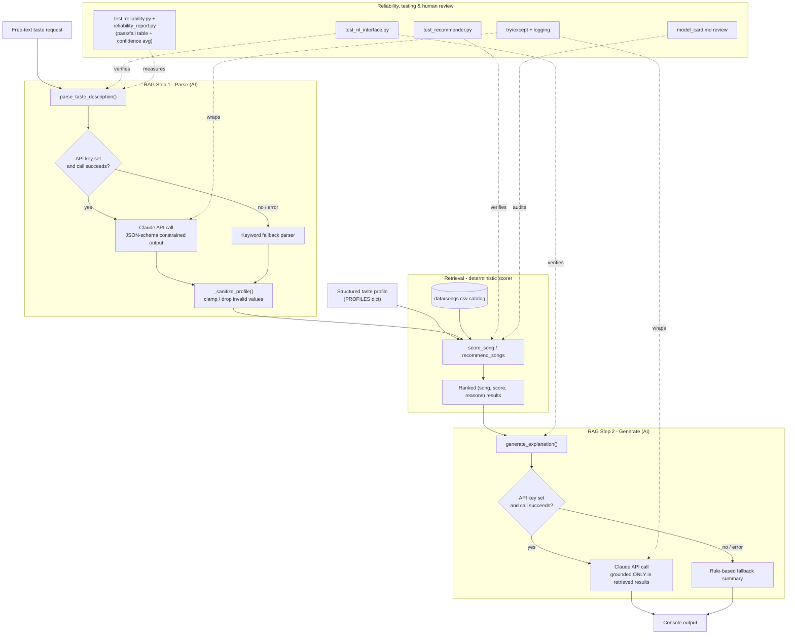

# 🎵 VibeCheck — AI-Enhanced Music Recommender

## Original Project (Modules 1–3)

The original project is **VibeCheck — Music Recommender Simulation**, built in Modules 1–3 as a
CodePath applied-AI assignment. Its original goal was to build a transparent, rules-based recommender:
given a listener's taste profile (favorite genre, favorite mood, and target audio-feature values like
energy and tempo), it scores every song in a small 18-song catalog with a hand-written points formula
and returns the top 5 with a plain-language reason for each pick. That version had **no AI or LLM
component at all** — it was pure arithmetic, evaluated by hand against a handful of taste profiles
(including deliberately adversarial ones) to characterize its behavior and biases.

## Summary

This iteration keeps that original scorer intact and adds a **Retrieval-Augmented Generation (RAG)**
layer on top of it: a listener can now describe their taste in plain English ("something to pump me up
before a workout") instead of filling in a structured profile. An LLM call turns that request into the
profile the scorer already understands, the deterministic scorer retrieves and ranks real songs against
it, and a second LLM call writes the final recommendation — grounded only in what the scorer actually
retrieved, never invented independently of it.

It matters because it's the difference between "bolting a chatbot onto a project" and integrating AI
into the actual decision path: the LLM doesn't pick the songs, translates the request in and narrates
the (already-computed, already-testable) result out. And because the whole thing is designed to degrade
gracefully with no API key, it demonstrates the AI feature is *architected in*, not just present when
convenient.

---

## Architecture Overview

The system has three stages — parse (AI), retrieve (deterministic), generate (AI) — with a rule-based
fallback at both AI stages and a testing/review layer that checks the pieces humans actually need to
trust. Full source: [diagrams/architecture.mmd](diagrams/architecture.mmd).



**Components:**

- **Parser** (`parse_taste_description`, `src/nl_interface.py`) — turns free text into a structured
  profile plus a confidence score, via a JSON-schema-constrained Claude call, or a keyword heuristic
  if no key is set.
- **Retriever / scorer** (`score_song`, `recommend_songs`, `src/recommender.py`) — the original,
  fully deterministic points engine. Never touched by the LLM's output directly; everything passes
  through `_sanitize_profile()` first.
- **Generator** (`generate_explanation`, `src/nl_interface.py`) — writes the final recommendation from
  the retriever's output, or falls back to printing the retriever's own reasons.
- **Checks** — three automated test files (including a dedicated reliability suite, `src/reliability.py`
  + `tests/test_reliability.py` + `scripts/reliability_report.py`) plus the human-authored bias review
  in `model_card.md`. See [Testing Summary](#testing-summary) below for real results.

---

## Setup Instructions

1. Create and activate a virtual environment (optional but recommended):

   ```bash
   python -m venv .venv
   source .venv/bin/activate      # Mac/Linux
   .venv\Scripts\activate         # Windows
   ```

2. Install dependencies:

   ```bash
   pip install -r requirements.txt
   ```

3. *(Optional)* Enable the AI feature by setting an Anthropic API key:

   ```bash
   export ANTHROPIC_API_KEY=sk-ant-...
   export CLAUDE_MODEL=claude-haiku-4-5   # optional: cheaper/faster override (default: claude-opus-5)
   ```

   Without a key, the app still runs end-to-end using the rule-based fallback described below.

4. Run the app — either as a CLI or as a web UI:

   ```bash
   python -m src.main          # CLI: runs all demo profiles + the NL mode, then exits
   streamlit run app.py        # Web UI: interactive, opens in your browser
   ```

   The Streamlit UI (`app.py`) is a thin wrapper — three tabs (structured profile, natural-language/RAG,
   and a live reliability report) that call the exact same functions as the CLI. It also has an
   `ANTHROPIC_API_KEY` field in the sidebar, so you can paste in a key for the session without exporting
   an environment variable (it's kept in memory only, never written to disk).

5. Run the test suite:

   ```bash
   pytest
   ```

6. *(Optional)* Run the reliability report — a pass/fail table plus average confidence score for the
   parsing feature (see [Testing Summary](#testing-summary)):

   ```bash
   python -m scripts.reliability_report
   ```

---

## Reproducible Execution Evidence

Everything below is **real, unedited terminal output**, captured by actually running the commands shown
— not a transcript written by hand. Environment: fresh virtualenv, dependencies installed from
`requirements.txt`, `ANTHROPIC_API_KEY` unset (I don't have Anthropic API credits in this development
environment), so every AI-feature call below ran its rule-based fallback path — the code path is
identical either way; only which branch executes differs. `python -m src.main` prints `Loaded songs: 18`
once at startup; omitted below where repeated for brevity.

### ✅ End-to-end system run (structured-profile mode, 2 inputs)

```bash
$ python -m src.main
```

<details>
<summary><b>Input 1 — High-Energy Pop (genre=pop, mood=happy, target_energy=0.85)</b></summary>

```
Top 5 recommendations

1. Sunrise City — Neon Echo
   genre: pop  |  mood: happy  |  score: 8.76
   reasons:
     • genre match: pop (+2.0)
     • mood match: happy (+1.0)
     • energy 0.82 vs target 0.85 (+1.94)
     • tempo bpm 118 vs target 125 (+1.40)
     • acousticness 0.18 vs target 0.15 (+1.46)
     • valence 0.84 vs target 0.85 (+0.49)
     • danceability 0.79 vs target 0.85 (+0.47)

2. Gym Hero — Max Pulse
   genre: pop  |  mood: intense  |  score: 7.54
   reasons:
     • genre match: pop (+2.0)
     • energy 0.93 vs target 0.85 (+1.84)
     • tempo bpm 132 vs target 125 (+1.40)
     • acousticness 0.05 vs target 0.15 (+1.35)
     • valence 0.77 vs target 0.85 (+0.46)
     • danceability 0.88 vs target 0.85 (+0.48)

3. Rooftop Lights — Indigo Parade
   genre: indie pop  |  mood: happy  |  score: 6.47
   ...
```

</details>

<details>
<summary><b>Input 2 — Deep Intense Rock (genre=rock, mood=intense, target_energy=0.9)</b></summary>

```
Top 5 recommendations

1. Storm Runner — Voltline
   genre: rock  |  mood: intense  |  score: 8.88
   reasons:
     • genre match: rock (+2.0)
     • mood match: intense (+1.0)
     • energy 0.91 vs target 0.9 (+1.98)
     • tempo bpm 152 vs target 150 (+1.47)
     • acousticness 0.1 vs target 0.1 (+1.50)
     • valence 0.48 vs target 0.4 (+0.46)
     • danceability 0.66 vs target 0.6 (+0.47)

2. Gym Hero — Max Pulse
   genre: pop  |  mood: intense  |  score: 6.29
   reasons:
     • mood match: intense (+1.0)
     • energy 0.93 vs target 0.9 (+1.94)
     • tempo bpm 132 vs target 150 (+1.25)
     • acousticness 0.05 vs target 0.1 (+1.42)
     • valence 0.77 vs target 0.4 (+0.32)
     • danceability 0.88 vs target 0.6 (+0.36)

3. Iron Verdict — Blacktide
   genre: metal  |  mood: tense  |  score: 5.45
   ...
```

</details>

Different inputs, correctly different rankings, both grounded in the same real catalog data.

### ✅ AI feature behavior (RAG) — 3 free-text inputs

Same command (`python -m src.main` runs this section automatically after the structured profiles above).
Each line shows the exact input, the profile the AI feature extracted from it, that profile's confidence
score, and the retrieval-grounded output built from it:

```
################################################################
# Natural Language Mode (RAG)
################################################################

Request: "I want something to pump me up before a workout, high energy and loud"
Parsed profile (keyword fallback, confidence=0.14): {'target_energy': 0.92}
[rule-based mode — set ANTHROPIC_API_KEY to enable natural-language understanding]

1. Gym Hero by Max Pulse (score 1.98) — energy 0.93 vs target 0.92 (+1.98)
2. Storm Runner by Voltline (score 1.98) — energy 0.91 vs target 0.92 (+1.98)
3. Pulse Reactor by Kilo Signal (score 1.92) — energy 0.96 vs target 0.92 (+1.92)

Request: "Something mellow and acoustic for a rainy afternoon of studying"
Parsed profile (keyword fallback, confidence=0.29): {'target_energy': 0.3, 'target_acousticness': 0.85}
[rule-based mode — set ANTHROPIC_API_KEY to enable natural-language understanding]

1. Library Rain by Paper Lanterns (score 3.38) — energy 0.35 vs target 0.3 (+1.90); acousticness 0.86 vs target 0.85 (+1.48)
2. Paper Boats by Wren & Hollow (score 3.36) — energy 0.33 vs target 0.3 (+1.94); acousticness 0.9 vs target 0.85 (+1.42)
3. Spacewalk Thoughts by Orbit Bloom (score 3.35) — energy 0.28 vs target 0.3 (+1.96); acousticness 0.92 vs target 0.85 (+1.40)

Request: "Upbeat happy pop, kind of like a summer road trip"
Parsed profile (keyword fallback, confidence=0.43): {'favorite_genre': 'pop', 'favorite_mood': 'happy', 'target_valence': 0.85}
[rule-based mode — set ANTHROPIC_API_KEY to enable natural-language understanding]

1. Sunrise City by Neon Echo (score 3.50) — genre match: pop (+2.0); mood match: happy (+1.0); valence 0.84 vs target 0.85 (+0.49)
2. Gym Hero by Max Pulse (score 2.46) — genre match: pop (+2.0); valence 0.77 vs target 0.85 (+0.46)
3. Rooftop Lights by Indigo Parade (score 1.48) — mood match: happy (+1.0); valence 0.81 vs target 0.85 (+0.48)
```

With `ANTHROPIC_API_KEY` set, the exact same code path runs the live model instead — the log line reads
`Parsed profile (LLM, confidence=...)` and the block under it is Claude's grounded prose rather than the
bracketed rule-based listing. Same command, same three inputs, different branch.

### ✅ Reliability / guardrail evidence

**Automated test suite** (`pytest -v`, real output, 14/14 passing):

```
$ pytest -v
============================= test session starts ==============================
collecting ... collected 14 items

tests/test_nl_interface.py::test_keyword_fallback_parse_extracts_genre_mood_and_energy PASSED [  7%]
tests/test_nl_interface.py::test_keyword_fallback_parse_handles_no_signal PASSED [ 14%]
tests/test_nl_interface.py::test_parse_taste_description_without_api_key_uses_fallback PASSED [ 21%]
tests/test_nl_interface.py::test_sanitize_profile_drops_unknown_genre_and_clamps_numbers PASSED [ 28%]
tests/test_nl_interface.py::test_generate_explanation_without_api_key_falls_back_to_summary PASSED [ 35%]
tests/test_recommender.py::test_recommend_returns_songs_sorted_by_score PASSED [ 42%]
tests/test_recommender.py::test_explain_recommendation_returns_non_empty_string PASSED [ 50%]
tests/test_reliability.py::test_reliability_case[workout request -> high energy] PASSED [ 57%]
tests/test_reliability.py::test_reliability_case[mellow acoustic request -> low energy, high acousticness] PASSED [ 64%]
tests/test_reliability.py::test_reliability_case[explicit genre + mood -> extracted verbatim] PASSED [ 71%]
tests/test_reliability.py::test_reliability_case[vague request, no clear signal -> no crash, no invented keys] PASSED [ 78%]
tests/test_reliability.py::test_reliability_case[empty string -> handled gracefully] PASSED [ 85%]
tests/test_reliability.py::test_reliability_case[contradictory request -> handled without crashing] PASSED [ 92%]
tests/test_reliability.py::test_confidence_scores_are_in_valid_range PASSED [100%]

============================== 14 passed in 0.04s ==============================
```

**Reliability report** (`python -m scripts.reliability_report`, real output — human-readable table plus
the one-line summary):

```
$ python -m scripts.reliability_report
| Test Input | Evaluation Criteria | Mode | Confidence | Result |
|---|---|---|---|---|
| I want something to pump me up before a workout, high energy and loud | target_energy >= 0.7 | keyword fallback | 0.14 | Pass |
| Something mellow and acoustic for a rainy afternoon of studying | target_energy <= 0.5 and target_acousticness >= 0.6 | keyword fallback | 0.29 | Pass |
| Upbeat happy pop, kind of like a summer road trip | favorite_genre == 'pop' and favorite_mood == 'happy' | keyword fallback | 0.43 | Pass |
| play me some music | returns a dict with only known profile keys | keyword fallback | 0.00 | Pass |
| (empty string) | returns a dict, does not raise | keyword fallback | 0.00 | Pass |
| sad rainy lofi vibes but I also want to dance all night | returns a dict with only known profile keys, does not raise | keyword fallback | 0.43 | Pass |

6 out of 6 tests passed. Confidence scores averaged 0.21.
```

Full interpretation of these numbers (what the confidence values mean, why 6/6 is weaker evidence than it
looks, what's still unverified) is in [Testing Summary](#testing-summary) below.

### ✅ Clear outputs for each case

Every case above shows a distinct input tied to a distinct, traceable output: a different structured
profile produces a different top-5 (Input 1 vs Input 2); a different free-text request produces a
different parsed profile, confidence score, and recommendation (all 3 RAG examples); and every reliability
case shows its specific pass/fail result next to the criterion it was judged against, not a generic
"looks fine." Nothing here is asserted without the log line to back it up.

---

## Design Decisions

**Genre/mood are soft bonuses, never hard filters.** Excluding non-matching songs would make partial
profiles and near-genre songs (e.g. a *metal* track for a *rock* fan) disappear entirely. Scoring them
as bonuses lets the system degrade gracefully instead of returning nothing.

**Weights are deliberately uneven** (genre +2.0, mood +1.0, energy/tempo/acousticness up to
+1.5–2.0, valence/danceability up to +0.5 — see `src/recommender.py`). Genre is the coarsest, most
confident signal a listener gives; energy/tempo/acousticness are the strongest audio differentiators in
this catalog; valence/danceability are weaker signals, weighted down on purpose rather than guessed at
uniformly.

**RAG over a single free-form LLM call.** I could have asked an LLM to just "recommend songs from this
list" directly. Instead the LLM only handles translation in (parse) and narration out (generate); the
actual ranking is the same deterministic, already-tested scorer. Trade-off: less flexible than letting
the LLM reason freely over the whole catalog, but the ranking stays auditable, reproducible, and
impossible for the LLM to hallucinate a song into.

**Schema-constrained parsing + a sanitization guardrail**, rather than trusting raw LLM JSON. The parse
step uses `output_config.format` so malformed JSON can't come back, and `_sanitize_profile()` re-checks
every field afterward (unknown genres/moods dropped, numbers clamped to valid ranges) before it ever
reaches the scorer. Trade-off: more code than "just parse the JSON," but it means a bad or adversarial
model response can't corrupt a ranking.

**Graceful fallback instead of a hard dependency on an API key.** Both AI calls are wrapped in
try/except and fall back to a rule-based path (keyword parser; the scorer's own reasons) on any failure
— missing key, network issue, rate limit. Trade-off: fallback output is noticeably less fluent than what
the LLM would produce, but the project runs and is fully testable with zero API cost or network access.

**Model choice.** Defaults to `claude-opus-5`, overridable via `CLAUDE_MODEL` (e.g. `claude-haiku-4-5`
for a cheaper/faster run) — this task (short parsing + short grounded summaries) doesn't need frontier
reasoning, so cost-sensitive users have an easy downgrade path.

**Tiny, hand-labeled catalog (18 songs).** Deliberately small so every scoring decision is inspectable
by hand — see [model_card.md](model_card.md) for the bias analysis this made possible, and for the full
catalog-size trade-off discussion.

---

## Testing Summary

**Reliability system.** Beyond the unit tests, `src/reliability.py` defines a fixed set of taste
requests paired with a checkable expectation about what `parse_taste_description()` should extract —
including edge cases (empty input, a vague request with no signal, a self-contradictory request) chosen
specifically to see whether the parser fails safely rather than crashing or hallucinating fields. The
same case list backs two things: `tests/test_reliability.py` (so a regression fails CI) and
`scripts/reliability_report.py`, a standalone script that prints the table below and can be re-run any
time with `python -m scripts.reliability_report`.

Every parse also returns a **confidence score (0–1)** — logged and printed on every run — as a second,
independent reliability signal. On the LLM path it's the model's own self-assessment (asked for
explicitly in the parse prompt); on the offline fallback path it's a coverage proxy (fraction of the 7
profile fields the keyword matcher actually filled in). The two aren't directly comparable, which is
exactly why the table below reports both the pass/fail result *and* the confidence side by side.

Real output from `python -m scripts.reliability_report`, run in this environment with no API key set (so
every case ran the keyword-fallback parser, not the LLM):

| Test Input | Evaluation Criteria | Mode | Confidence | Result |
|---|---|---|---|---|
| I want something to pump me up before a workout, high energy and loud | `target_energy >= 0.7` | keyword fallback | 0.14 | Pass |
| Something mellow and acoustic for a rainy afternoon of studying | `target_energy <= 0.5 and target_acousticness >= 0.6` | keyword fallback | 0.29 | Pass |
| Upbeat happy pop, kind of like a summer road trip | `favorite_genre == 'pop' and favorite_mood == 'happy'` | keyword fallback | 0.43 | Pass |
| play me some music | returns a dict with only known profile keys | keyword fallback | 0.00 | Pass |
| *(empty string)* | returns a dict, does not raise | keyword fallback | 0.00 | Pass |
| sad rainy lofi vibes but I also want to dance all night | returns a dict with only known profile keys, does not raise | keyword fallback | 0.43 | Pass |

**6 out of 6 tests passed. Confidence scores averaged 0.21** — low, as expected, since the fallback
parser can only ever fill 5 of the 7 profile fields and several test cases are deliberately vague or
contradictory. A reviewer with an API key should re-run the same command: I'd expect the LLM path to
pass the same 6 cases with meaningfully *higher* average confidence on the clear-signal requests (rows
1–3) and *lower* self-reported confidence specifically on the vague/contradictory ones (rows 4–6) —
that gap would be the real evidence the model's confidence score is tracking genuine uncertainty rather
than being a constant.

**What worked:**
- The full `pytest` suite passes (14 tests): `tests/test_recommender.py` (scorer correctness),
  `tests/test_nl_interface.py` (keyword-parser accuracy, guardrail clamping/dropping, fallback
  explanation), and `tests/test_reliability.py` (the 6 cases above, plus a confidence-range check) — all
  runnable offline, no API key required.
- Manually ran `python -m src.main` end-to-end in this environment (no API key) and confirmed both the
  structured-profile mode and the natural-language fallback mode produce correct, ranked output — the
  transcripts earlier in this README are real, not fabricated.
- A sensitivity experiment (doubling the energy weight, halving the genre weight — see git history)
  showed the top-5 rankings were surprisingly stable, because in this catalog genre and energy are
  correlated (rock songs are already loud; lofi songs are already quiet). The one profile that did
  change got *slightly worse* — raw energy pulled in an off-vibe aggressive track — which validated the
  original 2.0/2.0 weight balance rather than suggesting a better one.

**What didn't work / couldn't be verified here:**
- I don't have Anthropic API credits configured in this development environment, so the **live LLM
  parse and generate calls have not been run and verified against real responses** — only the fallback
  path has been exercised end-to-end, for both the reliability suite and the demo transcripts. The schema
  constraint and sanitization guardrail exist specifically to make that untested path safe on its first
  real run, but a reviewer with a key should re-run `python -m scripts.reliability_report` and
  `python -m src.main` to confirm live output quality and real confidence scores.
- The scorer's exact-string genre/mood matching (documented in `model_card.md`) means the LLM parser can
  correctly extract "aggressive" from a request but the scorer still won't credit it toward an "intense"
  profile — a limitation in the retriever, not something the AI layer can compensate for.

**What I learned:** most of the "trust" work in an AI feature isn't in the prompt — it's in the code
around it. Constraining the parser's output schema, sanitizing before scoring, and having a fallback
path meant I could test almost the entire pipeline without ever calling the API, and be confident the
one untested piece (the live model response) is bounded by guardrails on both sides rather than trusted
blindly. Building a dedicated reliability harness also forced me to write down *specific, checkable*
expectations (e.g. "energy >= 0.7") instead of eyeballing whether output "looked reasonable" — the
empty-string and vague-input cases in particular wouldn't have been caught by just reading transcripts.

---

## Reflection

Building the original scorer taught me that a recommender is just a scoring rule plus a sort. Adding the
AI layer on top taught me a different lesson: most of the engineering effort in "adding AI" isn't the
LLM call itself, it's designing for the ways that call can fail, be slow, cost money, or return something
you didn't ask for — and making sure the rest of the system still works when it does.

For the graded responsible-AI reflection — how I collaborated with AI while building this, one helpful
and one flawed AI suggestion I caught, and the system's full limitations — see
[**model_card.md**](model_card.md).

### What This Project Says About Me as an AI Engineer

I default to designing for failure before I design for the happy path — the reason this project runs
and is fully testable with zero API access is that I asked "what happens when this call fails, is slow,
or isn't available" before I wrote the first prompt, not after. I also don't take an AI collaborator's
output at face value just because it compiles: I read the model default it picked for me, noticed it
didn't actually match a constraint I'd stated a few messages earlier, and wrote that down instead of
quietly shipping it (see `model_card.md`). And I'd rather publish an honest "6 out of 6 passed, but here's
exactly what that does and doesn't prove" than let a green test suite imply more confidence than the
evidence supports. If this project says one thing about how I work, it's that I treat "does it look done"
and "does it actually work, and how do I know" as two different questions — and I only stop at the first
one when I've explicitly said so.
